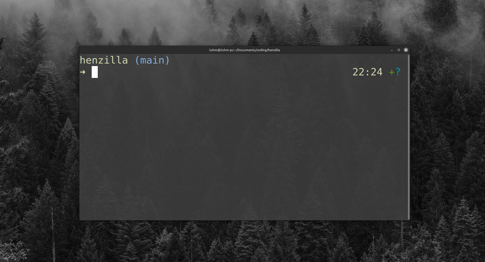
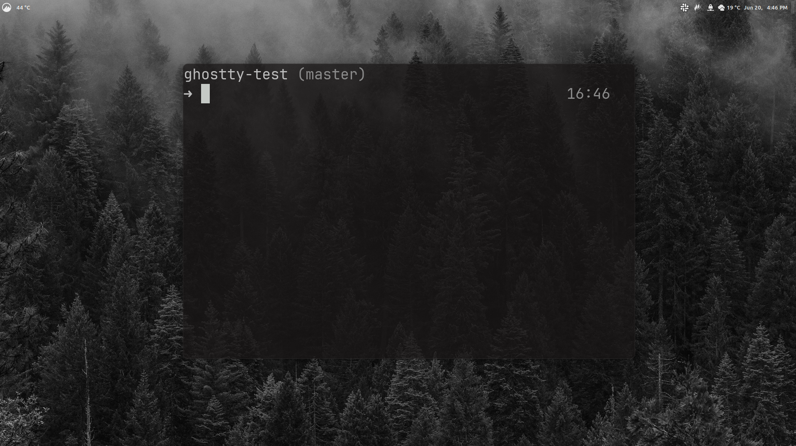

# henzilla.zsh-theme

A custom [oh-my-zsh](https://ohmyz.sh) theme inspired by the [gozilla theme](https://github.com/ohmyzsh/ohmyzsh/wiki/themes#gozilla).


default


##

my setup with ghostty and grayscale


## 📦 Installation

### Manual (oh-my-zsh)

1. Clone or download this repository.

```bash
git clone https://github.com/henriqueluhm/henzilla.git
```

2. Copy the theme file into your oh-my-zsh themes directory:
```bash
cp henzilla/henzilla.zsh-theme ~/.oh-my-zsh/themes/
```

3. Edit your ~/.zshrc file and set the theme:
```bash
ZSH_THEME="henzilla"
```

4. Apply the changes (or restart your terminal):
```bash
source ~/.zshrc
```

## License
MIT
